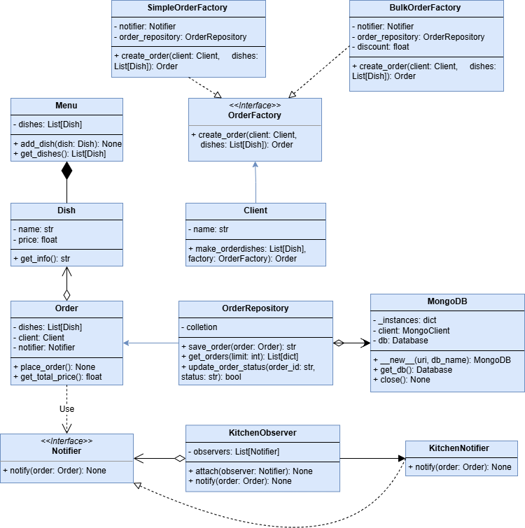

# food_order

## Проектування системи відповідно до принципів SOLID

### Визначення ключових класів
- *Dish* – страва в меню
- *Menu* – меню зі списком страв
- *Client* – клієнт ресторану
- *Order* – замовлення клієнта
- *KitchenNotifier* – обробник сповіщень для кухні

### Створення інтерфейсів
- *Notifier* для сповіщення.
- *OrderFactory* для створення замовлень.

### Побудова UML-діаграми

### Аналіз діаграми з точки зору принципів SOLID

- **S (Single Responsibility Principle)**: Кожен клас має єдину відповідальність:
  - Dish відповідає за страви,
  - Menu за колекцію страв, 
  - Client за клієнта, 
  - Order за замовлення, 
  - OrderFactory за створення замовлень, 
  - Notifier за повідомлення.
- **O (Open/Closed Principle)**: Система розширюється через інтерфейси OrderFactory та Notifier, що дозволяє додавати нові типи фабрик замовлень та сповіщень без зміни існуючого коду.
- **L (Liskov Substitution Principle)**: 
  - SimpleOrderFactory реалізує OrderFactory, 
  - KitchenNotifier реалізує Notifier.
- **I (Interface Segregation Principle)**: Інтерфейси OrderFactory та Notifier мають мінімальний набір методів.
- **D (Dependency Inversion Principle)**: Клас Client залежить від абстракції OrderFactory, а Order залежить від абстракції Notifier, а не від конкретних реалізацій.

## Розробка системи за допомогою TDD (Test-Driven Development

### Модульні тести 

#### test_order.py
- **test_place_order**: Перевіряє, що при розміщенні замовлення викликається метод сповіщення з правильним замовленням.
- **test_create_order**: Перевіряє створення замовлення з однією стравою та правильним клієнтом.
- **test_order_total_price**: Перевіряє правильність розрахунку загальної вартості замовлення з кількома стравами.
- **test_create_order_empty_dishes**: Перевіряє, що створення замовлення з порожнім списком страв викликає помилку.
- **test_create_order_no_client**: Перевіряє, що створення замовлення без клієнта викликає помилку.

#### Реалізація функціональності
**Результат тестів до реалізації логіки методів**

**Результат тестів після реалізації логіки методів**

#### test_menu.py
- **test_add_dish_to_menu**: Перевіряє додавання страви до меню та її наявність у списку.
- **test_get_dishes**: Перевіряє отримання списку страв з меню, що містить кілька страв.
- **test_get_empty_menu**: Перевіряє, що порожнє меню повертає порожній список страв.
- **test_add_invalid_dish**: Перевіряє, що додавання некоректної страви викликає помилку.

#### Реалізація функціональності
**Результат тестів до реалізації логіки методів**

**Результат тестів після реалізації логіки методів**

#### test_dish.py
- **test_dish_creation**: Перевіряє створення страви з правильними назвою та ціною.
- **test_dish_get_info**: Перевіряє формат виведення інформації про страву (назва та ціна).
- **test_dish_negative_price**: Перевіряє, що створення страви з від’ємною ціною викликає помилку.
- **test_dish_empty_name**: Перевіряє, що створення страви з порожньою назвою викликає помилку.

#### Реалізація функціональності
**Результат тестів до реалізації логіки методів**

**Результат тестів після реалізації логіки методів**

#### test_simple_order_factory.py
- **test_factory_init**: Перевіряє ініціалізацію фабрики замовлень з правильним сповіщувачем.

#### Реалізація функціональності
**Результат тестів до реалізації логіки методів**

**Результат тестів після реалізації логіки методів**

#### test_client.py
- **test_client_name_update**: Перевіряє створення клієнта з правильним ім’ям.
- **test_make_order**: Перевіряє створення замовлення клієнтом з однією стравою.
- **test_client_empty_name**: Перевіряє, що створення клієнта з порожнім ім’ям викликає помилку.
- **test_make_order_empty_dishes**: Перевіряє, що створення замовлення з порожнім списком страв викликає помилку.

#### Реалізація функціональності
**Результат тестів до реалізації логіки методів**

**Результат тестів після реалізації логіки методів**

#### test_notifier.py
- **test_notify**: Перевіряє, що сповіщувач коректно обробляє замовлення.
- **test_notify_invalid_order**: Перевіряє, що передача некоректного замовлення викликає помилку.

#### Реалізація функціональності
**Результат тестів до реалізації логіки методів**

**Результат тестів після реалізації логіки методів**

#### test_order_factory.py
- **test_create_order**: Перевіряє створення замовлення через фабрику з правильним клієнтом та стравою.
- **test_create_order_empty_dishes**: Перевіряє, що створення замовлення з порожнім списком страв викликає помилку.
- **test_create_order_no_client**: Перевіряє, що створення замовлення без клієнта викликає помилку.

#### Реалізація функціональності
**Результат тестів до реалізації логіки методів**

**Результат тестів після реалізації логіки методів**

## Використані шаблони проектування

### Singleton 
- **Файл**: `database.py`
- **Опис**: Клас `MongoDB` реалізує шаблон Singleton для забезпечення єдиного екземпляра підключення до бази даних MongoDB. Це гарантує, що всі компоненти системи використовують один і той самий об’єкт бази даних, уникаючи дублювання підключень.
- **Особливості**:
  - Зберігання екземплярів у словнику `_instances` за ключем `(uri, db_name)`.
  - Метод `close` для коректного завершення підключення.
- **Тести** (`test_database.py`):
  - `test_database_instance`: Перевіряє, що створення двох екземплярів `MongoDB` з однаковими параметрами повертає той самий об’єкт.
  - `test_different_parameters`: Перевіряє, що при різних параметрах (`db_name`) створюються різні екземпляри.
  
### Factory 
- **Файли**: `order_factory.py`, `simple_order_factory.py`, `bulk_order_factory.py`
- **Опис**: Заводський шаблон використано для створення двох типів замовлень:
  - **Звичайні замовлення** (`SimpleOrderFactory`): створюють замовлення з будь-якою кількістю страв без знижок.
  - **Масові замовлення** (`BulkOrderFactory`): створюють замовлення з щонайменше 5 стравами, застосовуючи знижку (за замовчуванням 10%) до цін страв.
- **Особливості**:
  - Абстрактний клас `OrderFactory` визначає інтерфейс для створення замовлень.
  - Обидва заводи дозволяють інтегрувати сповіщувач (`notifier`) і репозиторій замовлень (`order_repository`).
- **Тести**:
  - `test_order_factory.py`:
    - `test_create_order`: Перевіряє, що `SimpleOrderFactory` створює замовлення з правильним клієнтом і стравами.
    - `test_create_order_empty_dishes`: Перевіряє, що викликається виняток, якщо список страв порожній.
    - `test_create_order_no_client`: Перевіряє, що викликається виняток, якщо клієнт відсутній.
    - `test_create_order_with_repository`: Перевіряє, що замовлення асоціюється з переданим репозиторієм.
  - `test_simple_order_factory.py`:
    - `test_simple_factory_creates_order`: Перевіряє, що `SimpleOrderFactory` створює замовлення з правильними параметрами.
    - `test_simple_factory_empty_dishes`: Перевіряє, що викликається виняток для порожнього списку страв.
  - `test_bulk_order_factory.py`:
    - `test_bulk_factory_creates_discounted_order`: Перевіряє, що `BulkOrderFactory` створює замовлення з 5 стравами та застосовує знижку.
    - `test_bulk_factory_minimum_dishes`: Перевіряє, що викликається виняток, якщо кількість страв менша за 5.
    - `test_bulk_factory_invalid_discount`: Перевіряє, що викликається виняток для некоректної знижки.
    
### Observer 
- **Файли**: `notifier.py`, `kitchen_observer.py`, `kitchen_notifier.py`
- **Опис**: Шаблон спостерігача використано для сповіщення кухні про нові замовлення, забезпечуючи відокремлений дизайн.
  - Клас `KitchenObserver` виступає суб’єктом, який керує списком спостерігачів і викликає їх методи `notify`.
  - Клас `KitchenNotifier` є конкретним спостерігачем, який виводить повідомлення про замовлення (ім’я клієнта та список страв).
- **Особливості**:
  - Гнучка архітектура дозволяє додавати нові спостерігачі (наприклад, для сповіщення менеджера чи служби доставки).
  - Перевірка на `None` для замовлення забезпечує надійність.
- **Тести**:
  - `test_observer.py`:
    - `test_observer_notifies_all_attached`: Перевіряє, що `KitchenObserver` викликає `notify` для всіх прикріплених спостерігачів.
    - `test_kitchen_notifier_output`: Перевіряє, що `KitchenNotifier` виводить коректне повідомлення про замовлення.
    - `test_observer_with_invalid_order`: Перевіряє, що `KitchenObserver` викликає виняток для невалідного замовлення (`None`).
  - `test_notifier.py`:
    - `test_notify`: Перевіряє, що `KitchenNotifier` викликає метод `notify` з правильним замовленням.
    - `test_notify_invalid_order`: Перевіряє, що `KitchenNotifier` викликає виняток для невалідного замовлення (`None`).
    
### Додаткові компоненти
- **Файл**: `order_repository.py`
- **Опис**: Клас `OrderRepository` відповідає за збереження замовлень у MongoDB, отримання останніх замовлень (з лімітом) і оновлення статусу замовлення.
- **Особливості**:
  - Збереження даних замовлення, включно з ім’ям клієнта, списком страв, загальною вартістю, датою створення та статусом.
  - Використання `bson.ObjectId` для роботи з ідентифікаторами замовлень.

## Оновлена UML-діаграма

### Зв'язки наслідування (трикутна стрілка)
1. **SimpleOrderFactory → OrderFactory**: Клас SimpleOrderFactory реалізує інтерфейс OrderFactory
2. **BulkOrderFactory → OrderFactory**: Клас BulkOrderFactory реалізує інтерфейс OrderFactory
3. **KitchenNotifier → Notifier**: Клас KitchenNotifier реалізує інтерфейс Notifier

### Зв'язки агрегації (пуста ромбовидна стрілка)
1. **Menu ◇→ Dish**: Клас Menu містить колекцію об'єктів класу Dish, але не відповідає за їх життєвий цикл
2. **Order ◇→ Dish**: Клас Order містить колекцію об'єктів класу Dish, але не відповідає за їх життєвий цикл
3. **KitchenObserver ◇→ Notifier**: Клас KitchenObserver містить список спостерігачів, що є об'єктами інтерфейсу Notifier

### Зв'язки композиції (заповнена ромбовидна стрілка)
1. **Order ◆→ Client**: Клас Order містить об'єкт класу Client як свою частину і відповідає за його життєвий цикл
2. **Order ◆→ Notifier**: Клас Order містить об'єкт інтерфейсу Notifier як свою частину

### Зв'язки залежності (пунктирна стрілка)
1. **Client --→ OrderFactory**: Клас Client використовує інтерфейс OrderFactory у методі make_order
2. **KitchenNotifier --→ Notifier**: Клас KitchenNotifier реалізує інтерфейс Notifier (пунктирна стрілка наслідування)
3. **SimpleOrderFactory --→ OrderFactory**: Клас SimpleOrderFactory реалізує інтерфейс OrderFactory (пунктирна стрілка наслідування)
4. **BulkOrderFactory --→ OrderFactory**: Клас BulkOrderFactory реалізує інтерфейс OrderFactory (пунктирна стрілка наслідування)

### Зв'язки асоціації (звичайна стрілка)
1. **OrderRepository → Order**: Клас OrderRepository використовує клас Order для операцій збереження, запиту тощо
2. **OrderRepository ↔ MongoDB**: Двостороння асоціація між OrderRepository та MongoDB, де OrderRepository використовує MongoDB для зберігання даних
3. **Client → Order**: Клас Client створює об'єкти класу Order через метод make_order
4. **KitchenObserver → KitchenNotifier**: Клас KitchenObserver асоціюється з KitchenNotifier для повідомлення про зміни

### Зв'язки використання (Use)
1. **Order → Notifier**: Клас Order використовує інтерфейс Notifier для сповіщень через метод notify

