# food_order

## Проектування системи відповідно до принципів SOLID

### Визначення ключових класів
- *Dish* – страва в меню
- *Menu* – меню зі списком страв
- *Client* – клієнт ресторану
- *Order* – замовлення клієнта
- *KitchenNotifier* – обробник сповіщень для кухні

### Створення інтерфейсів
- *Notifier* для сповіщення.
- *OrderFactory* для створення замовлень.

### Побудова UML-діаграми

### Аналіз діаграми з точки зору принципів SOLID

- **S (Single Responsibility Principle)**: Кожен клас має єдину відповідальність:
  - Dish відповідає за страви,
  - Menu за колекцію страв, 
  - Client за клієнта, 
  - Order за замовлення, 
  - OrderFactory за створення замовлень, 
  - Notifier за повідомлення.
- **O (Open/Closed Principle)**: Система розширюється через інтерфейси OrderFactory та Notifier, що дозволяє додавати нові типи фабрик замовлень та сповіщень без зміни існуючого коду.
- **L (Liskov Substitution Principle)**: 
  - SimpleOrderFactory реалізує OrderFactory, 
  - KitchenNotifier реалізує Notifier.
- **I (Interface Segregation Principle)**: Інтерфейси OrderFactory та Notifier мають мінімальний набір методів.
- **D (Dependency Inversion Principle)**: Клас Client залежить від абстракції OrderFactory, а Order залежить від абстракції Notifier, а не від конкретних реалізацій.

## Розробка системи за допомогою TDD (Test-Driven Development

### Модульні тести 

#### test_order.py
- **test_place_order**: Перевіряє, що при розміщенні замовлення викликається метод сповіщення з правильним замовленням.
- **test_create_order**: Перевіряє створення замовлення з однією стравою та правильним клієнтом.
- **test_order_total_price**: Перевіряє правильність розрахунку загальної вартості замовлення з кількома стравами.
- **test_create_order_empty_dishes**: Перевіряє, що створення замовлення з порожнім списком страв викликає помилку.
- **test_create_order_no_client**: Перевіряє, що створення замовлення без клієнта викликає помилку.

#### Реалізація функціональності
**Результат тестів до реалізації логіки методів**
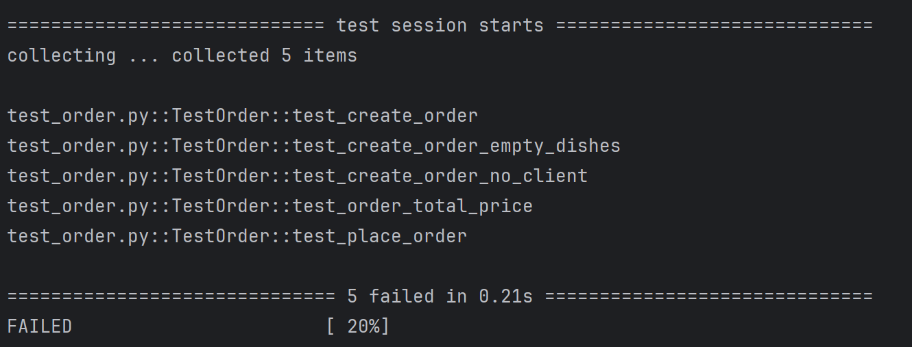

**Результат тестів після реалізації логіки методів**
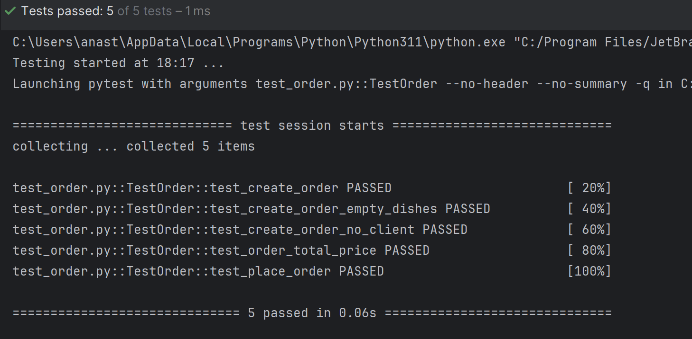

#### test_menu.py
- **test_add_dish_to_menu**: Перевіряє додавання страви до меню та її наявність у списку.
- **test_get_dishes**: Перевіряє отримання списку страв з меню, що містить кілька страв.
- **test_get_empty_menu**: Перевіряє, що порожнє меню повертає порожній список страв.
- **test_add_invalid_dish**: Перевіряє, що додавання некоректної страви викликає помилку.

#### Реалізація функціональності
**Результат тестів до реалізації логіки методів**
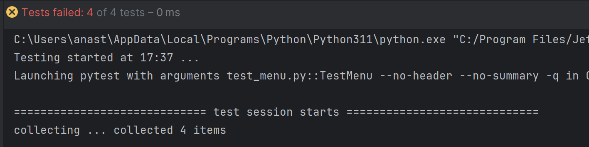

**Результат тестів після реалізації логіки методів**
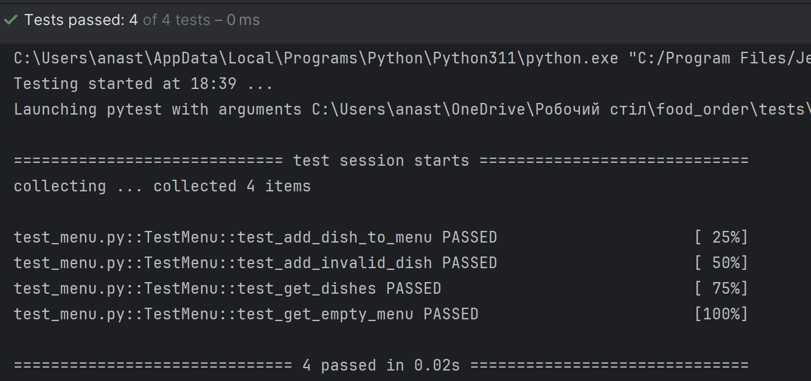

#### test_dish.py
- **test_dish_creation**: Перевіряє створення страви з правильними назвою та ціною.
- **test_dish_get_info**: Перевіряє формат виведення інформації про страву (назва та ціна).
- **test_dish_negative_price**: Перевіряє, що створення страви з від’ємною ціною викликає помилку.
- **test_dish_empty_name**: Перевіряє, що створення страви з порожньою назвою викликає помилку.

#### Реалізація функціональності
**Результат тестів до реалізації логіки методів**
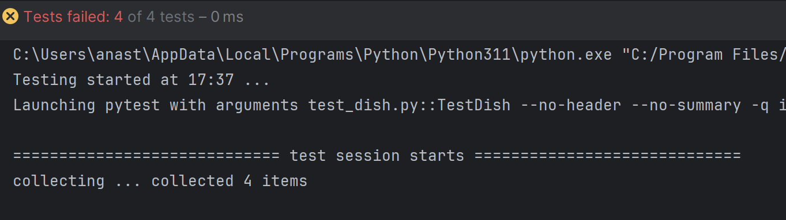

**Результат тестів після реалізації логіки методів**
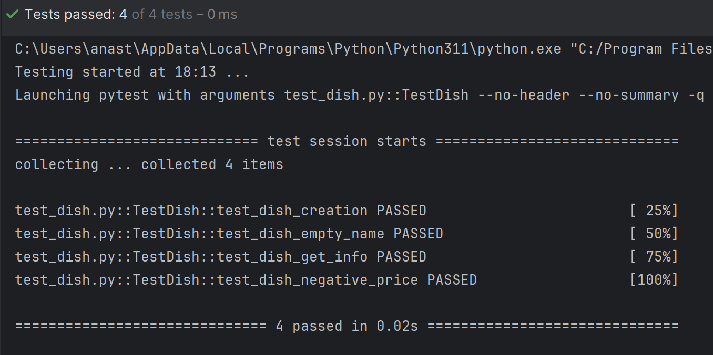

#### test_simple_order_factory.py
- **test_factory_init**: Перевіряє ініціалізацію фабрики замовлень з правильним сповіщувачем.

#### Реалізація функціональності
**Результат тестів до реалізації логіки методів**
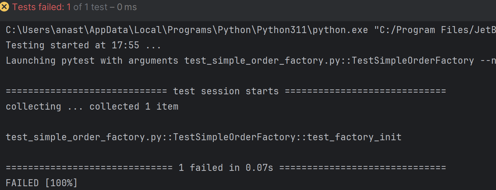

**Результат тестів після реалізації логіки методів**
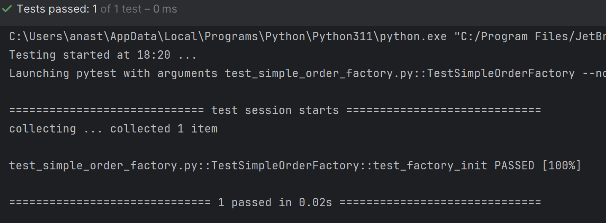

#### test_client.py
- **test_client_name_update**: Перевіряє створення клієнта з правильним ім’ям.
- **test_make_order**: Перевіряє створення замовлення клієнтом з однією стравою.
- **test_client_empty_name**: Перевіряє, що створення клієнта з порожнім ім’ям викликає помилку.
- **test_make_order_empty_dishes**: Перевіряє, що створення замовлення з порожнім списком страв викликає помилку.

#### Реалізація функціональності
**Результат тестів до реалізації логіки методів**
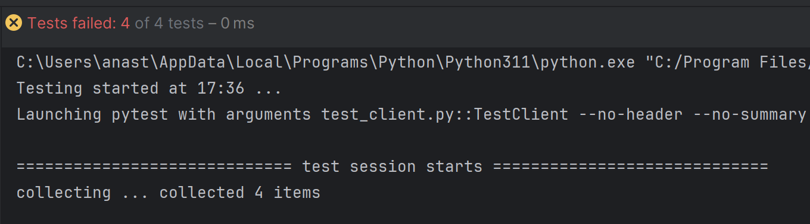

**Результат тестів після реалізації логіки методів**
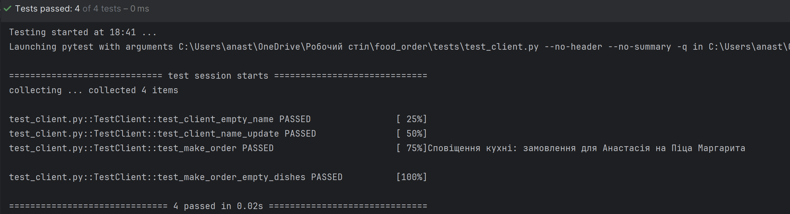

#### test_notifier.py
- **test_notify**: Перевіряє, що сповіщувач коректно обробляє замовлення.
- **test_notify_invalid_order**: Перевіряє, що передача некоректного замовлення викликає помилку.

#### Реалізація функціональності
**Результат тестів до реалізації логіки методів**
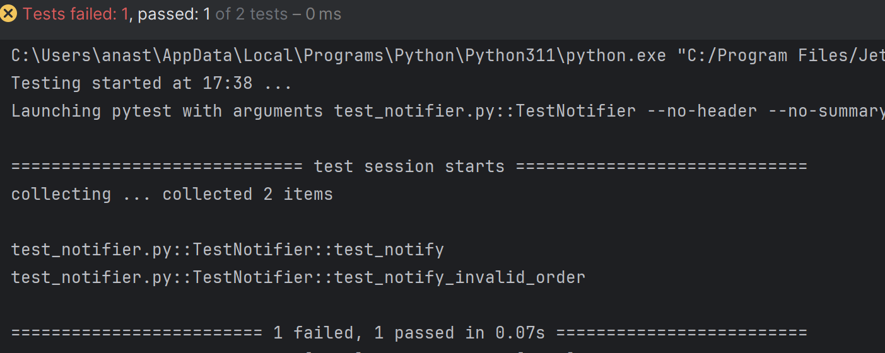

**Результат тестів після реалізації логіки методів**
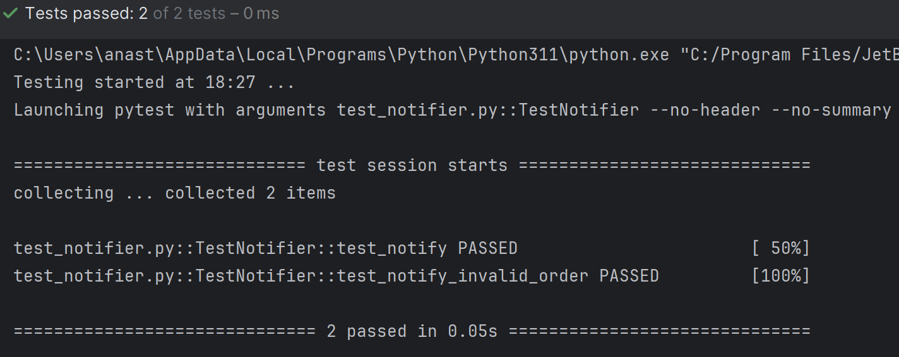

#### test_order_factory.py
- **test_create_order**: Перевіряє створення замовлення через фабрику з правильним клієнтом та стравою.
- **test_create_order_empty_dishes**: Перевіряє, що створення замовлення з порожнім списком страв викликає помилку.
- **test_create_order_no_client**: Перевіряє, що створення замовлення без клієнта викликає помилку.

#### Реалізація функціональності
**Результат тестів до реалізації логіки методів**
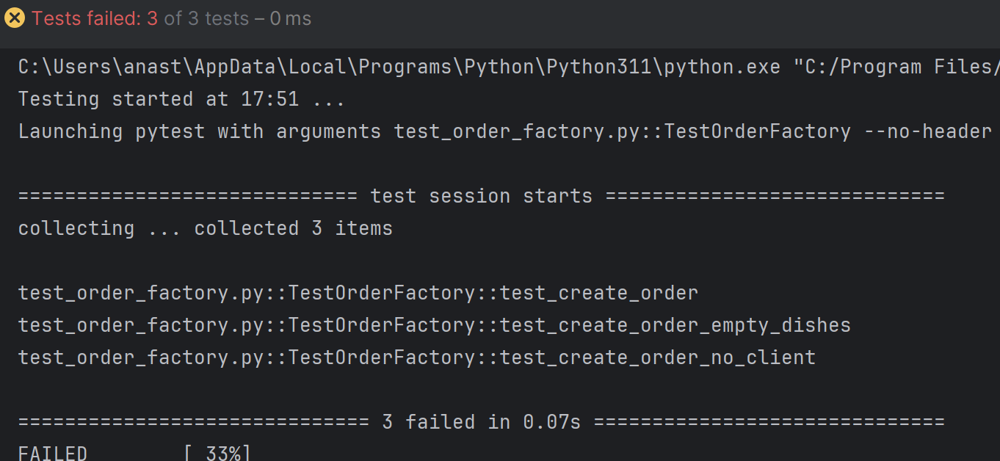

**Результат тестів після реалізації логіки методів**
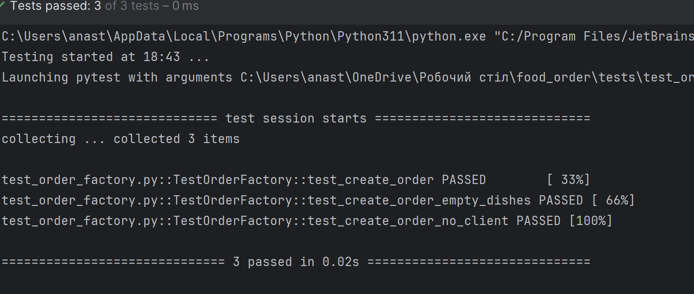
