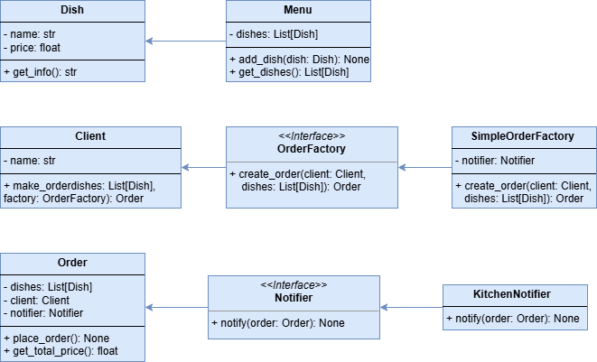

# food_order

## Проектування системи відповідно до принципів SOLID

### Визначення ключових класів
- *Dish* – страва в меню
- *Menu* – меню зі списком страв
- *Client* – клієнт ресторану
- *Order* – замовлення клієнта
- *KitchenNotifier* – обробник сповіщень для кухні

### Створення інтерфейсів
- *Notifier* для сповіщення.
- *OrderFactory* для створення замовлень.

### Побудова UML-діаграми

### Аналіз діаграми з точки зору принципів SOLID

- **S (Single Responsibility Principle)**: Кожен клас має єдину відповідальність:
  - Dish відповідає за страви,
  - Menu за колекцію страв, 
  - Client за клієнта, 
  - Order за замовлення, 
  - OrderFactory за створення замовлень, 
  - Notifier за повідомлення.
- **O (Open/Closed Principle)**: Система розширюється через інтерфейси OrderFactory та Notifier, що дозволяє додавати нові типи фабрик замовлень та сповіщень без зміни існуючого коду.
- **L (Liskov Substitution Principle)**: 
  - SimpleOrderFactory реалізує OrderFactory, 
  - KitchenNotifier реалізує Notifier.
- **I (Interface Segregation Principle)**: Інтерфейси OrderFactory та Notifier мають мінімальний набір методів.
- **D (Dependency Inversion Principle)**: Клас Client залежить від абстракції OrderFactory, а Order залежить від абстракції Notifier, а не від конкретних реалізацій.